# GeoLens V2 — Development Completion Report

**Date:** April 25, 2026  
**Status:** ✅ Core Pipeline Functional — Frontend Integration Complete

---

## 📁 Prior Art — Where to Find V1 Docs

> [!NOTE]
> The **V1 progress report** exists at the project root. It is NOT in a conversation artifact folder.

| Document | Location | Content |
|----------|----------|---------|
| V1 Progress Report | [geolens_progress_report.md](file:///d:/1.Project/Personal/GeoLens/geolens_progress_report.md) | M1–M4 milestones, V1 architecture (4 parallel agents), frontend stack, next steps |
| V2 Backend Pipeline Plan | [implementation_plan.md](file:///C:/Users/shrey/.gemini/antigravity/brain/b343494f-931c-434e-9c91-db3442463fcb/implementation_plan.md) | Full A2A sequential architecture design, agent schemas, priority list |
| V2 Frontend Integration Plan | [implementation_plan.md](file:///C:/Users/shrey/.gemini/antigravity/brain/88b21421-daf3-4ef8-a323-6ac6b30898c0/implementation_plan.md) | SSE streaming design, DayPlanner component breakdown, tab switcher |

---

## 1. Executive Summary

GeoLens V2 transforms the app from a **parallel-fetch presentation layer** into a **true sequential agent-to-agent (A2A) reasoning pipeline**. Each agent's output becomes the next agent's input — removing any agent breaks the downstream chain.

The V1 `/api/city-info` endpoint and its 4 parallel intelligence cards remain untouched and fully operational. V2 adds a completely new pipeline alongside V1.

```mermaid
graph LR
    U["User Input<br/>city + budget + preferences"] --> S["Agent 1: Scout<br/>(Event Discovery)"]
    S -->|"events[]"| C["Agent 2: Curator<br/>(Itinerary Builder)"]
    C -->|"itinerary[]"| N["Agent 3: Navigator<br/>(Logistics Planner)"]
    N -->|"enriched plan"| R["Agent 4: Narrator<br/>(Plan Presenter)"]
    R -->|"SSE stream → final payload"| FE["Frontend<br/>Day Planner Panel"]

    style S fill:#4f46e5,color:#fff
    style C fill:#7c3aed,color:#fff
    style N fill:#2563eb,color:#fff
    style R fill:#059669,color:#fff
```



---

## 2. What Was Built — File Inventory

### 2.1 Backend — New Files

| File | Size | Purpose |
|------|------|---------|
| [agents/state.py](file:///d:/1.Project/Personal/GeoLens/backend/agents/state.py) | 4.1 KB | Shared `PlannerState` TypedDict schema — 6 strongly-typed dicts |
| [agents/llm.py](file:///d:/1.Project/Personal/GeoLens/backend/agents/llm.py) | 3.4 KB | Centralized LLM factory: Gemini 2.5 Flash primary, Groq LLaMA fallback |
| [agents/scout.py](file:///d:/1.Project/Personal/GeoLens/backend/agents/scout.py) | 18.3 KB | Agent 1: Ticketmaster + GNews + Foursquare + Gemini LLM fallback |
| [agents/curator.py](file:///d:/1.Project/Personal/GeoLens/backend/agents/curator.py) | 9.1 KB | Agent 2: LLM itinerary building with budget reasoning |
| [agents/navigator.py](file:///d:/1.Project/Personal/GeoLens/backend/agents/navigator.py) | 10.1 KB | Agent 3: OpenRouteService route planning |
| [agents/narrator.py](file:///d:/1.Project/Personal/GeoLens/backend/agents/narrator.py) | 13.4 KB | Agent 4: LLM synthesis → conversational plan + UI payload |
| [agents/\_\_init\_\_.py](file:///d:/1.Project/Personal/GeoLens/backend/agents/__init__.py) | 615 B | Package init |
| [v2_graph.py](file:///d:/1.Project/Personal/GeoLens/backend/v2_graph.py) | 7.7 KB | LangGraph `StateGraph`: sequential wiring + both blocking and SSE streaming execution modes |
| [v2_state.py](file:///d:/1.Project/Personal/GeoLens/backend/v2_state.py) | 4.1 KB | Original state file (superseded by `agents/state.py`) |

### 2.2 Backend — Modified Files

| File | Change |
|------|--------|
| [main.py](file:///d:/1.Project/Personal/GeoLens/backend/main.py) | Added `POST /api/day-plan` and `POST /api/day-plan/stream` endpoints alongside the original `/api/city-info`. App version bumped to `2.0.0`. |
| [requirements.txt](file:///d:/1.Project/Personal/GeoLens/backend/requirements.txt) | Added `langchain-google-genai`, `langsmith`, Ticketmaster/ORS deps |
| `.env` | Added `GOOGLE_API_KEY`, `TICKETMASTER_API_KEY`, `LANGSMITH_API_KEY`, `OPENROUTESERVICE_API_KEY`, `GROQ_API_KEY` |

### 2.3 Frontend — New Files

| File | Size | Purpose |
|------|------|---------|
| [DayPlanner/PlannerPanel.tsx](file:///d:/1.Project/Personal/GeoLens/geolens-app/components/DayPlanner/PlannerPanel.tsx) | 8.3 KB | Top-level SSE state machine container — manages `idle → streaming → done/error` lifecycle |
| [DayPlanner/PlannerInput.tsx](file:///d:/1.Project/Personal/GeoLens/geolens-app/components/DayPlanner/PlannerInput.tsx) | 5.8 KB | Goal textarea + budget slider + fixed preference tag chips |
| [DayPlanner/TimelineCard.tsx](file:///d:/1.Project/Personal/GeoLens/geolens-app/components/DayPlanner/TimelineCard.tsx) | 8.7 KB | Vertical timeline with event/travel nodes and staggered animations |
| [DayPlanner/BudgetCard.tsx](file:///d:/1.Project/Personal/GeoLens/geolens-app/components/DayPlanner/BudgetCard.tsx) | 3.7 KB | Donut chart + over-budget warning |
| [DayPlanner/NarratorCard.tsx](file:///d:/1.Project/Personal/GeoLens/geolens-app/components/DayPlanner/NarratorCard.tsx) | 2.2 KB | Summary text + reasoning + citation source badges |

### 2.4 Frontend — Modified Files

| File | Change |
|------|--------|
| [AgentSidebar.tsx](file:///d:/1.Project/Personal/GeoLens/geolens-app/components/AgentSidebar.tsx) | Tab switcher added: **Intelligence** (V1 cards) ↔ **Day Planner** (V2 panel). `mapPins` prop forwarded up. |
| [GlobeCanvas.tsx](file:///d:/1.Project/Personal/GeoLens/geolens-app/components/GlobeCanvas.tsx) | Accepts `mapPins` prop; renders colored globe markers + route arcs from V2 plan output. |
| `lib/api.ts` | Added `streamDayPlan()` async iterator using `ReadableStream` + SSE parsing |
| `lib/types.ts` | Added `DayPlanResponse`, `DayPlan`, `TimelineItem`, `MapPin`, `BudgetBreakdown`, `Citation`, `ItineraryStop`, `TravelLeg`, `Logistics`, `V2Event` |

---

## 3. Architecture Deep Dive

### 3.1 State Schema (`agents/state.py`)

The shared state contract uses 6 strongly-typed `TypedDict` classes that accumulate across the pipeline:

```
PlannerState
├── Inputs (set once at pipeline start)
│   ├── city:        str
│   ├── user_goal:   str  (raw natural language)
│   ├── budget:      float
│   ├── preferences: list[str]
│   └── date:        str  (ISO)
│
├── Scout writes → events: list[Event]
│   └── Event: name, time, location, address, lat, lng, cost,
│               category, source, url, relevance_score
│
├── Curator writes → itinerary: list[ItineraryStop]
│   └── ItineraryStop: time, event_name, venue, cost, budget_remaining, notes
│
├── Navigator writes → logistics: Logistics
│   └── Logistics: legs, total_transport_cost, total_event_cost,
│                  grand_total, budget_ok, budget_warning
│
├── Narrator writes → plan: Plan
│   └── Plan: summary, reasoning, timeline, map_pins,
│              budget_breakdown, citations
│
└── errors: list[str]  (non-fatal, accumulated across all agents)
```

### 3.2 LLM Strategy (`agents/llm.py`)

Two-tier fault-tolerant LLM system:

| Tier | Model | Trigger |
|------|-------|---------|
| **Primary** | `gemini-2.5-flash` via `langchain-google-genai` | Default |
| **Fallback** | `llama-3.3-70b-versatile` via Groq | `429 RESOURCE_EXHAUSTED` or missing `GOOGLE_API_KEY` |

The `ainvoke_with_fallback()` helper is used by all 4 agents. Fallback is transparent — the pipeline continues without any agent knowing which LLM responded.

### 3.3 Scout Agent — Data Sources

Scout fans out to 3 live APIs **concurrently** via `asyncio.gather`, then deduplicates and ranks results:

| Source | API | Data Extracted | Traceable |
|--------|-----|----------------|-----------|
| **Ticketmaster** | `/discovery/v2/events.json` | Live events, venues, prices, times | `@traceable` |
| **GNews** | `/api/v4/search` | Event-related local news articles | `@traceable` |
| **Foursquare** | `/v3/places/search` | Top-rated venues by category | `@traceable` |
| **Gemini LLM** | (fallback only) | 6–8 plausible suggestions when all APIs return 0 results | `@traceable` |

**Geocoding:** City → (lat, lng) using a hardcoded table of 20 major cities first (zero API calls), then falls back to OpenRouteService geocode API.

**Relevance scoring:** Fuzzy SequenceMatcher comparison of event category tags vs. user preference tags → `0.0–1.0` float on every `Event`. Curator uses this to rank.

### 3.4 Graph Wiring (`v2_graph.py`)

```
START → scout_node → curator_node → navigator_node → narrator_node → END
```

Two execution modes from a single compiled `StateGraph`:
- `run_v2_graph()` — blocking `await graph.ainvoke()`, returns final dict
- `run_v2_graph_streaming()` — async generator running each node manually, yields SSE frames between steps

### 3.5 SSE Event Protocol

```
event: agent_start   data: {"agent": "scout"}
event: agent_done    data: {"agent": "scout", "event_count": 12}
event: agent_start   data: {"agent": "curator"}
event: agent_done    data: {"agent": "curator", "stop_count": 5}
event: agent_start   data: {"agent": "navigator"}
event: agent_done    data: {"agent": "navigator", "leg_count": 4, "budget_ok": true}
event: agent_start   data: {"agent": "narrator"}
event: agent_done    data: {"agent": "narrator", "has_plan": true}
event: complete      data: {full DayPlanResponse JSON}
event: error         data: {"message": "..."}
```

Agent failures are non-fatal — the pipeline continues, errors accumulate in `state["errors"]`, and the frontend shows a `Partial data` warning banner rather than crashing.

---

## 4. API Endpoints

| Method | Path | Version | Description |
|--------|------|---------|-------------|
| `GET` | `/health` | Both | Liveness check, returns `{"version": "2.0.0"}` |
| `POST` | `/api/city-info` | V1 | Parallel 4-agent city intelligence (unchanged) |
| `POST` | `/api/day-plan` | V2 | Blocking sequential A2A pipeline |
| `POST` | `/api/day-plan/stream` | V2 | SSE streaming version (used by frontend) |

**Request body for `/api/day-plan` and `/api/day-plan/stream`:**
```json
{
  "city": "San Francisco",
  "user_goal": "Plan my day in SF — budget $120, I like jazz and street food",
  "budget": 120.0,
  "preferences": ["jazz", "street food"],
  "date": "2026-04-25"
}
```

---

## 5. Frontend — Day Planner Flow

```
AgentSidebar (tab: "Day Planner")
└── PlannerPanel  (state machine: idle | streaming | done | error)
    ├── idle     → PlannerInput  (goal textarea + budget slider + preference chips)
    ├── streaming → Agent progress cards (animated spinner → ✓ / ✗ per agent)
    ├── done     → BudgetCard + NarratorCard + TimelineCard + error warnings
    └── error    → Error state + "Try Again" button

GlobeCanvas receives mapPins from PlannerPanel → renders colored markers + route arcs
```

The `streamDayPlan()` function in `lib/api.ts` reads the SSE `ReadableStream` from `/api/day-plan/stream` and yields typed `SSEFrame` objects to the React component.

---

## 6. Issues Discovered & Fixed During V2 Development

| Issue | Conversation | Resolution |
|-------|-------------|------------|
| **Scout/Curator producing no itinerary** — `v2_graph.py` state not propagating correctly | [Debugging GeoLens Pipeline Failures](convid:397ca02e-e5c9-47d7-bf6a-dc24b9529bb0) | Fixed state key naming mismatch between node return dict and `PlannerState` keys |
| **Gemini API key expired** — `API_KEY_INVALID` errors across all V2 agents | [Fixing Expired Gemini API Key](convid:23143f05-9961-4349-8fb0-558cd1a9e932) | Rotated `GOOGLE_API_KEY` in `.env` |
| **`429 RESOURCE_EXHAUSTED`** — Gemini free-tier quota exceeded mid-pipeline | [Debugging Backend Pipeline Logs](convid:d36a7b35-fd87-403a-8476-3030de2793e0) | Implemented `ainvoke_with_fallback()` in `llm.py` + updated all 4 agents to use it. Groq `llama-3.3-70b-versatile` as transparent fallback. |
| **IDE import warnings** — `.venv` not detected by VS Code | [Resolving Python Backend Dependencies](convid:27b014da-84ec-4615-a127-cb56a7eb2a21) | Pointed VS Code Python interpreter to `backend/.venv` |

---

## 7. Current System State

### Backend
- ✅ FastAPI server runs on `localhost:8000`
- ✅ V1 `/api/city-info` fully operational (unchanged from V1)
- ✅ V2 `/api/day-plan` blocking endpoint operational
- ✅ V2 `/api/day-plan/stream` SSE endpoint operational
- ✅ Gemini → Groq fallback on 429 errors
- ✅ LangSmith tracing active (`LANGSMITH_TRACING=true`)
- ✅ All 4 agents: Scout, Curator, Navigator, Narrator implemented

### Frontend
- ✅ Next.js app runs on `localhost:3000`
- ✅ Tab switcher: Intelligence (V1) ↔ Day Planner (V2)
- ✅ SSE streaming with real-time agent progress display
- ✅ Timeline, Budget donut, Narrator summary, Partial data warnings all rendering
- ✅ Globe map pins populated from Narrator's `map_pins` output

### Observability
- ✅ LangSmith: all 4 agent nodes traced with per-hop latency and token counts
- ✅ `@traceable` decorators on all Ticketmaster, GNews, Foursquare fetch functions
- ✅ Structured logging in every agent and graph executor

---

## 8. Known Gaps & Remaining Work

| Item | Priority | Notes |
|------|----------|-------|
| **Redis caching** | Medium | Deferred — currently using no cache. Same city re-hits all APIs on every request. |
| **MCP wrapper** | Low | Planned as thin FastMCP wrapper around `/api/day-plan`. Not yet implemented. |
| **Navigator routing quality** | Medium | ORS routing works, but transit vs. rideshare cost estimation is heuristic-only (no live pricing). |
| **Globe route arcs** | Low | `GlobeCanvas.tsx` receives `map_pins` but arc drawing between sequential stops is a visual enhancement not yet wired. |
| **User persistence** | Low | No saved plans / favorite cities yet (V1 "Next Steps" item). |
| **Unit tests** | Medium | `backend/tests/` directory not yet created. `test_api_only.py` and `test_run.py` exist but are one-off scripts, not a test suite. |
| **Production deployment** | Future | Cloud Run / Vercel deployment not yet done. Local dev only. |

---

## 9. How to Run

```bash
# Backend
cd d:\1.Project\Personal\GeoLens\backend
.venv\Scripts\activate
uvicorn main:app --reload --port 8000

# Frontend (separate terminal)
cd d:\1.Project\Personal\GeoLens\geolens-app
npm run dev
```

Open `http://localhost:3000` → click any globe city → switch to **Day Planner** tab → enter a goal → watch agents stream in real time.
